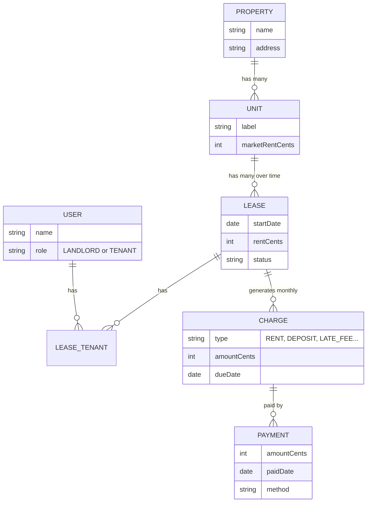
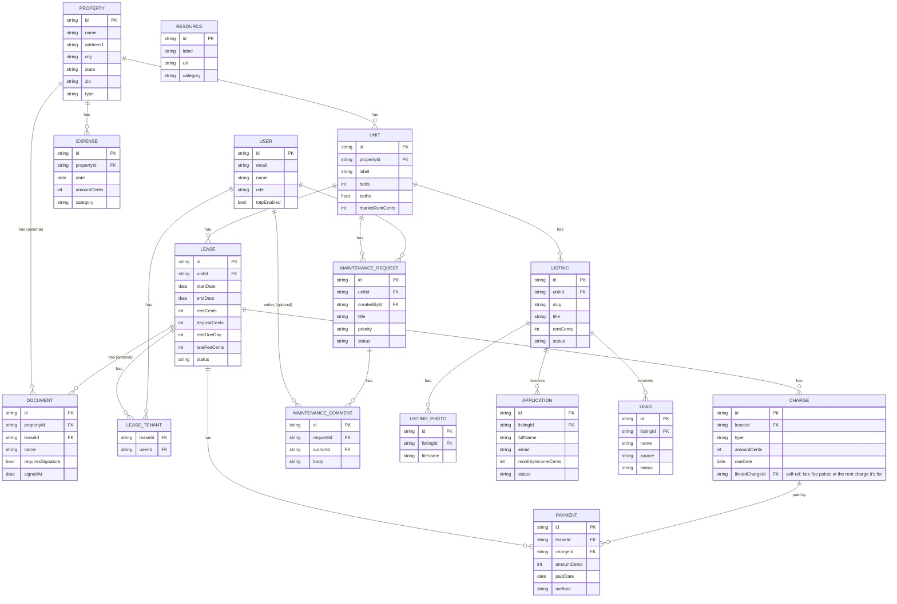
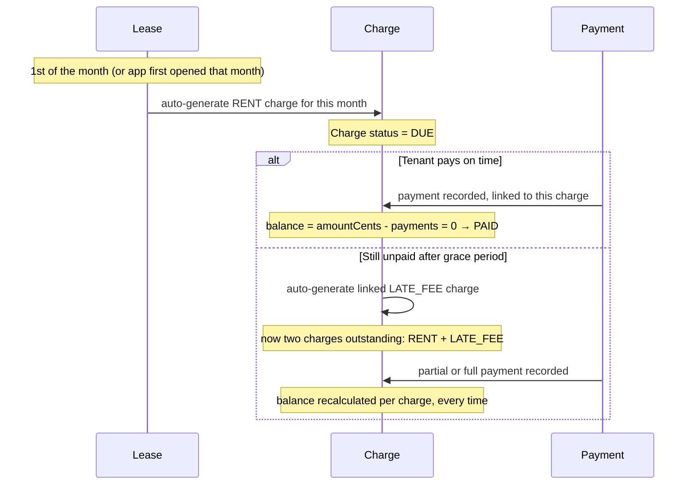
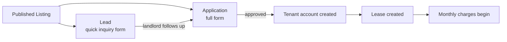
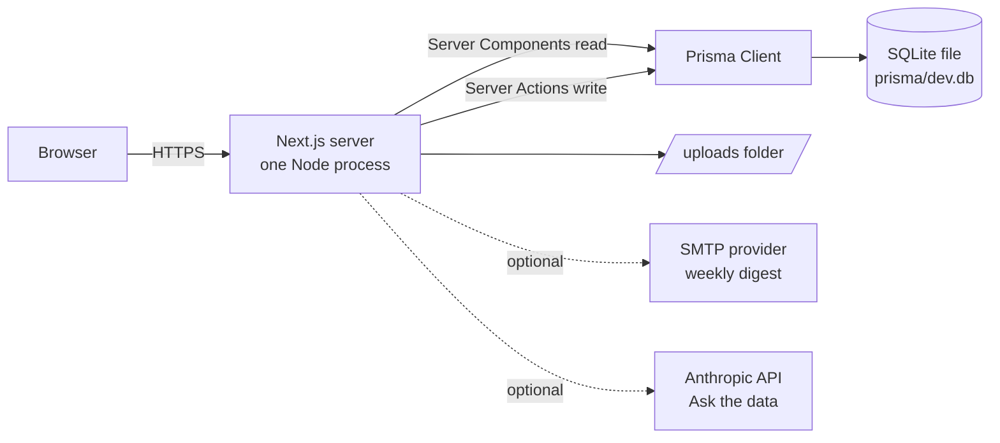

# Rentfolio, diagrams for discussion

Paste any block into [mermaid.live](https://mermaid.live) for an instant image, or open this
file's preview in VS Code (Markdown Preview Mermaid Support renders it inline).

## 1. Core relational schema (the "3 properties, 2 tenants" walkthrough)

The minimum set of tables that explain how rent collection actually works, this is the one
to put in front of Giri first. The key point: a `Lease` doesn't store a tenant directly: it
goes through `LeaseTenant`, a join table, because a lease can have more than one tenant and
the schema needs to support that without duplicating lease rows.

**The thing that directly answers his "$6k over 3 months, can't tell which payment was for
which month" problem:** every `Payment` row has a `chargeId` pointing at one specific
`Charge`. Balance owed on any charge is just `amountCents - SUM(linked payments)`. Nothing
free-floats the way a bank CSV does.

## 2. Full schema (every table, for reference)

Everything in `prisma/schema.prisma`, for whenever the conversation goes deeper than the
core flow above.

`RESOURCE` is intentionally standalone, saved links (court lookups, screening sites), not
tied to any other table.

## 3. Rent lifecycle (what actually happens each month)

## 4. Listing → lead/application → lease funnel

## 5. System architecture (how it's actually hosted)

One process, one file-based database, one folder of uploads. No separate database server,
no auth provider, no payment processor in the core path, that's what makes "self-hosted and
free" actually true rather than free-with-asterisks.
